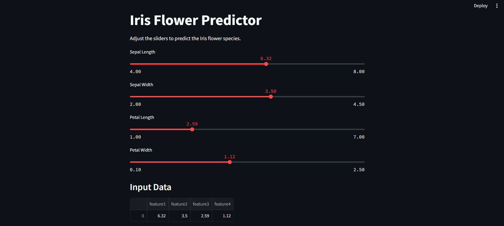
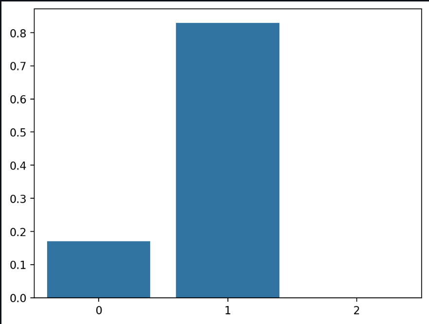

# Streamlit ML Model Deployment – Iris Flower Predictor

> 📝 This project was submitted as **Week 7 assignment** for the **Data Science Internship at Celebal Technology**.

This repository contains a deployed machine learning model using Streamlit to classify Iris flowers based on user input. The app provides real-time predictions and visualizations to help understand model output.

---

## 🔧 Features

- Interactive input sliders for flower measurements
- Real-time prediction using a trained RandomForestClassifier
- Probability distribution bar chart for model confidence
- Simple and clean Streamlit web interface

---

## 📁 Files Included

- `streamlit_app.py` – The main Streamlit web app
- `model.pkl` – Trained machine learning model (Random Forest)
- `Iris_Streamlit.ipynb` – Jupyter Notebook used to train and export the model
- `screenshot_1_input.png` – Screenshot showing user input panel
- `screenshot_2_prediction.png` – Screenshot showing predicted class
- `screenshot_3_chart.png` – Screenshot showing probability chart

---

##  Screenshot showing user input panel
 

## Screenshot showing predicted class
 

##  Screenshot showing probability chart
 


---

## 🚀 How to Run the App

1. Clone this repository or download the files.
2. Install the required libraries:

```bash
pip install streamlit pandas scikit-learn joblib matplotlib seaborn
